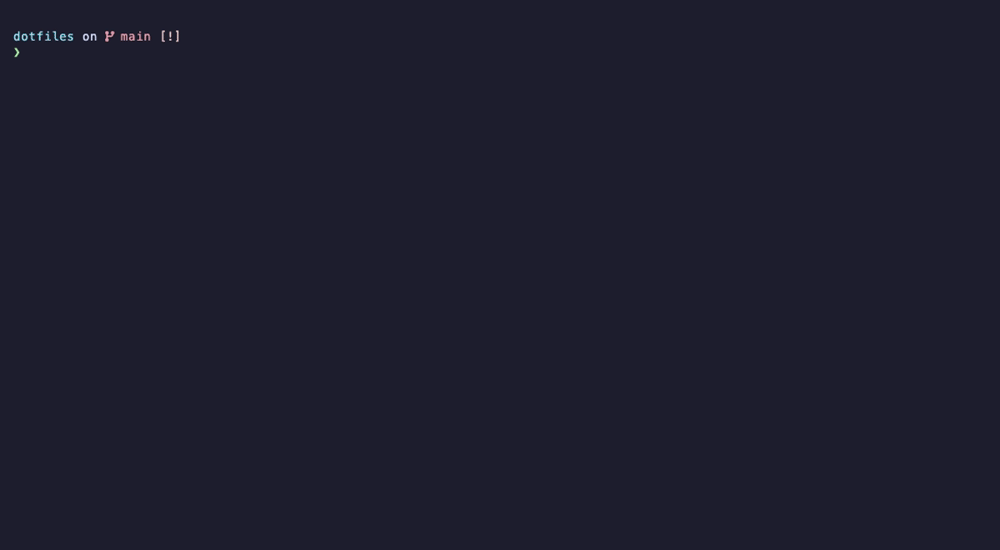

# Remerge dotfiles

A ready-to-use shell setup for your Mac. One command gives you a modern terminal
— a clean prompt, command autocompletion, syntax highlighting, and
autosuggestions — with nothing to configure.



Linux is supported on a best-effort basis: the installer clones the config and
links `~/.zshrc`, but it does **not** auto-install Homebrew or starship (that
step is macOS-only). Install [Homebrew](https://brew.sh) and
[starship](https://starship.rs) yourself, then open a new shell.

## Contents <!-- omit in toc -->

- [Getting started](#getting-started)
  - [Set your git identity](#set-your-git-identity)
- [What you get](#what-you-get)
  - [Homebrew](#homebrew)
  - [The shell foundation](#the-shell-foundation)
  - [XDG base directories](#xdg-base-directories)
  - [Your prompt and command line](#your-prompt-and-command-line)
  - [Languages and toolchains](#languages-and-toolchains)
    - [Mise-en-place](#mise-en-place)
    - [JavaScript (state of the art)](#javascript-state-of-the-art)
    - [JavaScript (legacy toolchain)](#javascript-legacy-toolchain)
    - [Python](#python)
    - [Ruby](#ruby)
    - [Go](#go)
  - [Command-line tools](#command-line-tools)
  - [Development and cloud](#development-and-cloud)
  - [Editors and terminal](#editors-and-terminal)
  - [Catppuccin Mocha everywhere](#catppuccin-mocha-everywhere)

## Getting started

Open the **Terminal** app, paste this line, and press Enter:

```sh
curl -fsSL https://raw.githubusercontent.com/remerge/dotfiles/main/install.sh | sh
```

> [!WARNING]
> The installer takes over `~/.config` as a checkout of this repository. If you
> already keep configuration there, any file whose path collides with one
> tracked in this repo will be **replaced**. Before changing anything, the
> installer lists every file it would overwrite, offers to show the full diff,
> and asks for confirmation — and files not tracked by this repo are left in
> place. Still, back up anything you care about first.

That's it. The installer will:

1. Install Apple's developer tools (for `git`) if they're missing.
2. Set up your shell configuration in `~/.config`.
3. **Ask for your name and email** to set up your git identity (see
   [below](#set-your-git-identity)).
4. Install Homebrew and everything in the [`Brewfile`](Brewfile)
5. Opens a fresh shell in [Ghostty](https://ghostty.org) so you land in a modern
   terminal.

To update everything later (Homebrew packages and plugins), run:

```sh
zup
```

This updates your Homebrew packages, the ZI plugin manager, and all installed
plugins in one go.

### Set your git identity

During setup the installer asks for your name and email and saves them to
`~/.config/git/local`, which git uses to author your commits. If you skipped the
prompt (just pressed Enter) or want to change them later, set them from the
command line:

```sh
git config --file ~/.config/git/local user.name "Your Name"
git config --file ~/.config/git/local user.email "you@remerge.io"
```

Or edit `~/.config/git/local` directly:

```ini
[user]
  name = Your Name
  email = you@remerge.io
```

Until it's set, git will ask you to configure your name and email on your first
commit. (Avoid `git config --global` here — because this repo lives at
`~/.config`, that may write into the shared `git/config` instead of `local`.)

## What you get

Everything below is set up automatically — the [`Brewfile`](Brewfile) installs
the tools and [`zsh/.zshrc`](zsh/.zshrc) wires each one up when it's present, so
there's nothing for you to configure. This section is a map of the pieces,
grouped by what they do, with a link to each project if you want to learn more.

### Homebrew

[Homebrew](https://brew.sh) is the macOS package manager — it installs both
command-line programs and native apps. On first launch the config installs
Homebrew (if it's missing) and then everything in the [`Brewfile`](Brewfile) –
the prompt, a terminal font with icons, the GNU command-line tools, `git`, and
the utilities listed below.

### The shell foundation

[Z shell](https://www.zsh.org) (`zsh`) is the program that runs your commands —
the default shell on macOS. The configuration starts by forcing a UTF-8 locale,
advertising truecolor, and raising the open-file limit.

[ZI](https://github.com/z-shell/zi) is a fast plugin manager for zsh. It
installs itself on first launch and then downloads and loads each plugin on
demand, keeping startup quick. A few small ZI add-ons support it: one sets
sensible [default plugin options](https://github.com/z-shell/z-a-default-ice),
another [caches command output](https://github.com/z-shell/z-a-eval) so it isn't
recomputed every launch, and a local helper loads plugins by convention.

[Oh My Zsh](https://github.com/ohmyzsh/ohmyzsh) contributes a handful of
well-worn library files — directory, key-binding, and color defaults plus
terminal-title handling — and the `..`, `...`, `....` shortcuts for moving up
directories. Your shell
[history](https://zsh.sourceforge.io/Doc/Release/Options.html#History) is kept
large. Run `zup` at any time to update Homebrew packages, ZI, and all plugins
in one go.

### XDG base directories

The [XDG base directory standard](https://specifications.freedesktop.org/basedir-spec/basedir-spec-latest.html)
defines fixed places for a program's files — configuration in `~/.config`,
caches in `~/.cache`, and data in `~/.local/share` — instead of each tool
scattering its own hidden dotfiles across your home directory. These dotfiles
follow the standard as much as possible: configs, caches, shell and REPL
histories, and package caches for every tool below are wired into their proper
XDG directory, even for tools that need a nudge to comply.

### Your prompt and command line

[Starship](https://starship.rs) is the prompt — the line shown before your
cursor. It displays the current directory, the active git branch and status, and
more, and it's fast and highly configurable. It uses Nerd Font icons
throughout.

As you type, [F-Sy-H](https://github.com/z-shell/F-Sy-H) colors the command line
— known commands one color, unknown ones another, with strings and paths
highlighted — so you spot typos before pressing Enter.
[zsh-autosuggestions](https://github.com/zsh-users/zsh-autosuggestions) suggests
the rest of a command in grey based on your history; press the right arrow (`→`)
to accept it. [zsh-autopair](https://github.com/hlissner/zsh-autopair)
automatically inserts the matching closing quote, bracket, or parenthesis — and
removes both when you delete one.

Press `Tab` to complete commands, file paths, options, git branches, and more.
[zsh-completions](https://github.com/zsh-users/zsh-completions) adds many extra
completion definitions on top of sensible, error-correcting defaults, and
[fzf-tab](https://github.com/Aloxaf/fzf-tab) turns the completion menu into a
fuzzy-searchable list with file previews. When you type a command that has a
shorter alias, [you-should-use](https://github.com/MichaelAquilina/zsh-you-should-use)
reminds you about it.

### Languages and toolchains

#### Mise-en-place

[Mise](https://mise.en.dev/) manages dev-tool versions, per-project environment
variables, and tasks across all languages — when a project pins a specific tool
version, mise provides it (OpenTofu is installed through it).

#### JavaScript (state of the art)

[Bun](https://bun.sh) is the all-in-one toolkit for modern JavaScript and
TypeScript — a runtime that executes TypeScript directly, plus a bundler, test
runner, and package manager in a single fast binary.
[Biome](https://biomejs.dev) is the matching formatter and linter for JS, TS,
JSON, and CSS.

#### JavaScript (legacy toolchain)

For projects that haven't moved yet, the classic toolchain is installed too:
[Node.js](https://nodejs.org), the original JavaScript runtime, and
[npm](https://docs.npmjs.com), Node's package manager.

#### Python

[Python](https://docs.python.org/3/) comes with a virtualenv-first `pip` and
Homebrew's `python`/`pip` on `PATH`.
[uv](https://github.com/astral-sh/uv) — an extremely fast Python package and
tool manager — installs standalone Python tools, and `zup` upgrades them.
[argcomplete](https://github.com/kislyuk/argcomplete#readme) (installed via uv)
adds tab completion for argparse-based Python programs.

#### Ruby

[Ruby](https://www.ruby-lang.org) is set up so Homebrew's Ruby comes first on
`PATH`, ahead of the outdated one that ships with macOS.

#### Go

[Go](https://go.dev) gets its `GOPATH` pointed at the cache directory, and
binaries you install with `go install` are added to `PATH`.

### Command-line tools

Everyday commands get modern replacements.
[eza](https://github.com/eza-community/eza) is an `ls` with icons and git
status, aliased to `l` and `lR`. [bat](https://github.com/sharkdp/bat) is a
`cat` with syntax highlighting and git integration, and it also colorizes
`man` pages. [duf](https://github.com/muesli/duf) is a friendlier `df`,
aliased over it, and [ncdu](https://dev.yorhel.nl/ncdu) lets you explore disk
usage interactively.

[atuin](https://github.com/atuinsh/atuin) keeps a searchable, optionally
synced shell history (`a`) — press `Ctrl-R` to search it — and
[fzf](https://github.com/junegunn/fzf) is the fuzzy finder that powers
interactive search and the completion menu.

[glow](https://github.com/charmbracelet/glow) renders Markdown right in the
terminal. [less](https://man7.org/linux/man-pages/man1/less.1.html), the
pager, is tuned for case-insensitive search and raw colors.

A few classic workhorses round things out:
[parallel](https://www.gnu.org/software/parallel/) runs commands in parallel,
[rsync](https://rsync.samba.org) copies and syncs files fast and
incrementally, and [wget](https://www.gnu.org/software/wget/) downloads files
over HTTP(S) and FTP(S).

### Development and cloud

[git](https://git-scm.com) is the version control system, set up with many
short aliases (`s`, `gl`, `gd`, …) and git-aware completion.
[direnv](https://github.com/direnv/direnv) loads and unloads environment
variables per directory from `.envrc` (`da` to allow), and
[tmux](https://github.com/tmux/tmux) is the terminal multiplexer (`T`), with
tpm managing its plugins.

For containers, [Docker](https://docs.docker.com) provides the CLI and
[Colima](https://github.com/abiosoft/colima) runs the container VM on macOS,
started in the background on demand.

On the cloud side, [OpenTofu](https://opentofu.org) — the open-source
Terraform fork (`tf`) — uses a shared plugin cache,
[gcloud](https://cloud.google.com/sdk), the Google Cloud SDK, has completion
enabled and usage reporting off, and [PostgreSQL](https://www.postgresql.org)
adds the client tools and headers to `PATH` for building against libpq.

For secrets, [SOPS](https://github.com/getsops/sops) edits files encrypted
with age, GPG, or cloud KMS, and [GnuPG](https://gnupg.org/) handles
encryption and signing. [1Password](https://1password.com) is the password
manager and CLI (`op`) and also provides the SSH agent, which
[SSH](https://www.openssh.com) is wired to when it's available.

### Editors and terminal

[Neovim](https://neovim.io) is the default `$EDITOR`, with `vim` aliased to
it. [VS Code](https://code.visualstudio.com) is configured too — its settings,
keybindings, and MCP config are symlinked in.
[Ghostty](https://ghostty.org) is the fast, native, GPU-accelerated terminal
emulator everything runs in, and [Claude](https://claude.ai) — Anthropic's AI
assistant CLI — is along for the ride.

### Catppuccin Mocha everywhere

The whole setup is themed with [Catppuccin](https://catppuccin.com) — the
soothing pastel theme — in its dark **Mocha** flavor, so every tool shares the
same look. The official Catppuccin port is used wherever one exists:

- [starship](https://github.com/catppuccin/starship) — the prompt palette
- [fzf](https://github.com/catppuccin/fzf) — the fuzzy finder and completion
  menu
- [bat](https://github.com/catppuccin/bat) — syntax highlighting, also used for
  `man` pages
- [glamour](https://github.com/catppuccin/glamour) — glow's Markdown rendering
- [delta](https://github.com/catppuccin/delta) — git diffs
- [atuin](https://github.com/catppuccin/atuin) — the shell-history search
- [tmux](https://github.com/catppuccin/tmux) — the status bar
- [bottom](https://github.com/catppuccin/bottom) — the system monitor
- [vim](https://github.com/catppuccin/vim) — the editor colorscheme
- [vscode](https://github.com/catppuccin/vscode) — VS Code's theme and icons

[Ghostty](https://ghostty.org) ships Catppuccin Mocha as a built-in theme; the
config simply selects it.
